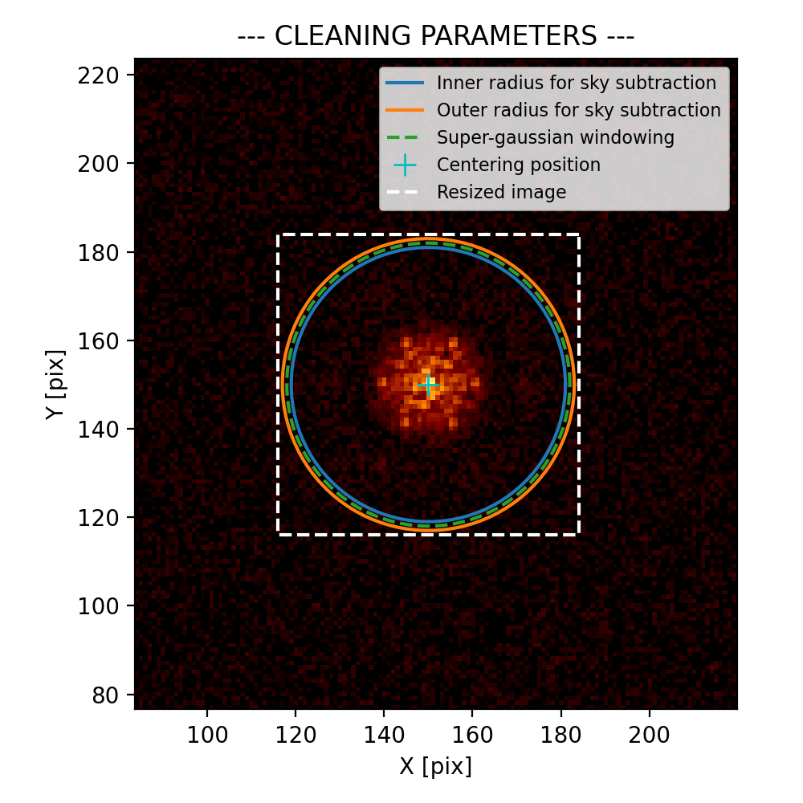
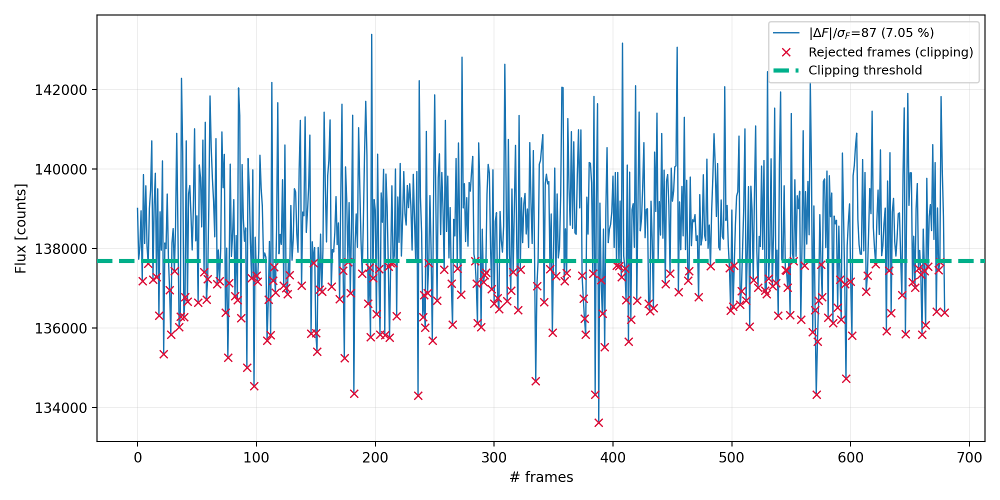

<a href="https://github.com/SydneyAstrophotonicInstrumentationLab/AMICAL"></a>

(**A**perture **M**asking **I**nterferometry **C**alibration and **A**nalysis **L**ibrary)

[](https://github.com/SydneyAstrophotonicInstrumentationLab/AMICAL) [](https://www.python.org/downloads/release/python-370/) 
 [](https://www.python.org/dev/peps/pep-0008/) [](https://pycqa.github.io/isort/)

## Install from source (for conda-based systems)

It is recommended (though not mandatory) to create a separate environment with `conda create -n <env_name>`.
Then, within your Conda env (`conda activate <env_name>`):

```bash
# Firstly, clone AMICAL repository on your computer
git clone https://github.com/SydneyAstrophotonicInstrumentationLab/AMICAL.git

cd AMICAL/

# You may need to install pip inside your new environment
conda install pip

# Install AMICAL
pip install -e .

```

## What can AMICAL do for you ?

AMICAL has been developed to provide an easy-to-use solution to process **A**perture **M**asking **I**nterferometry (AMI) data from major existing facilities:  [NIRISS](https://jwst-docs.stsci.edu/near-infrared-imager-and-slitless-spectrograph) on the JWST (first scientific interferometer operating in space), [SPHERE](https://www.eso.org/sci/facilities/paranal/instruments/sphere.html) and [VISIR](https://www.eso.org/sci/facilities/paranal/instruments/visir.html) from the European Very Large Telescope (VLT) and [VAMPIRES](https://www.naoj.org/Projects/SCEXAO/scexaoWEB/030openuse.web/040vampires.web/indexm.html) from SUBARU telescope (and more to come).

We focused our efforts to propose a user-friendly interface, though different sub-classes allowing to (1) **Clean** the reduced datacube from the standard instrument pipelines, (2) **Extract** the interferometrical quantities (visibilities and closure phases) using a Fourier sampling approach and (3) **Calibrate** those quantities to remove the instrumental biases.

Looking for a quickstart into AMICAL? Just have a look to the example scripts made for [NIRISS](example_NIRISS.py) and [SPHERE](example_NIRISS.py).

In addition (4), we include two external packages called [CANDID](https://github.com/amerand/CANDID) and [Pymask](https://github.com/AnthonyCheetham/pymask) to **analyse** the final outputs obtained from a binary-like sources (star-star or star-planet). We interfaced these stand-alone packages with AMICAL to quickly estimate our scientific results (e.g.: separation, position angle, contrast ratio, contrast limits, etc.) using different approaches (chi2 grid, MCMC, see [example_analysis.py](example_analysis.py) for details).

## Tutorials

In this tutorial, we will go through the different possibilities of AMICAL. You can find a detailed description of the principal functions and associated parameters in their docstrings (easily accessible with good editors, e.g.: vscode).

- [Step 1: clean and select data](#step-1-clean-and-select-data)
- [Step 2: extract observables](#step-2-extract-observables)
- [Step 3: calibrate V2 & CP](#step-3-calibrate-v2--cp)
- [Step 4: analyse with CANDID and Pymask](#step-4-analyse-with-candid-and-pymask)

To begin, we just need to import AMICAL library:

```python
import amical
```

### Step 1: clean and select data

The major part of data coming from general pipeline (applying dark, flat, distorsion, etc.) are not enought compliant with the Fourier extracting method developed within AMICAL.

The first step of AMICAL consists to clean the data in different way:

- Apply bad pixels correction (`bad_map`, `add_bad`, `remove_bad`)
- Remove residual sky background (`sky`, `r1`, `dr`)
- Crop and center the image (`isz`, `f_kernel`),
- Apply windowing (`apod`, `window`).

```python
nrm_file = 'my_nrm_data.fits'

clean_param = {'isz': 69, # final cropped image size [pix]
               'r1': 31, # Inner radius to compute sky [pix]
               'dr': 2, # Outer radius (r2 = r1 + dr) 
               'apod': True, # If True, apply windowing
               'window': 32 # FWHM of the super-gaussian (for windowing)
              }

# Firsly, check if the input parameters are valid
amical.check_data_params(nrm_file, **clean_param)
```

<p align="center">
 
</p>

If the cleaning parameters seem well located (cyan cross on the centre, sky radius outside the fringes pattern, etc.), we can apply the cleaning step to the data.

```python

cube_cleaned = amical.select_clean_data(nrm_file, **clean_param, clip=True, clip_fact=0.5)
```

During the cleaning step, you can decide to apply a lucky imaging approach (`clip`=True) to select only the best frames (based on the integrated fluxes compared to the median: threshold = median(fluxes) - `clip_fact` x std(fluxes)).

<p align="center">

</p>

### Step 2: extract observables

The second step is the core of AMICAL: we use the Fourier sampling approach to extract the interferometric observables (visibilities and closure phases). We implimented 4 different sampling methods (`peakmethod` = ('fft', 'gauss', 'square', 'unique')).

```python
params_ami = {"peakmethod": "fft",
              "maskname": "g7", # 7 holes mask of NIRISS
              "filtname": "F380M", # If not in the header
              "theta_detector": 0,
              "scaling_uv": 1,
              }

bs = amical.extract_bs(cube_cleaned, file_t, **params_ami)
```


### Step 3: calibrate V2 & CP

### Step 4: analyse with CANDID and Pymask

## Use policy and reference publication

If you use AMICAL in a publication, we encourage you to properly cite the reference paper published during the 2020 SPIE conference: [The James Webb Space Telescope aperture masking interferometer](https://ui.adsabs.harvard.edu/abs/2020SPIE11446E..11S/abstract). The library explanation is part of a broader description of the interferometric mode of NIRISS, so feel free to have a look at the exciting possibilities of AMI!

## Acknowledgements

This work is mainly a modern Python translation of the very well known (and old) IDL pipeline used to process and analyze Sparse Aperture Masking data. This pipeline, called "Sydney code", was developed by a lot of people over many years. Credit goes to the major developers, including Peter Tuthill, Mike Ireland and John Monnier. Many forks exist across the web and the last IDL version can be found [here](https://github.com/AnthonyCheetham/idl_masking). We hope that this brand new user-friendly Python version will be used in the future with the development of the AMI mode included with cutting edge instruments as JWST/NIRISS, VLT/SPHERE or VLT/VISIR (among others). ENJOY!
