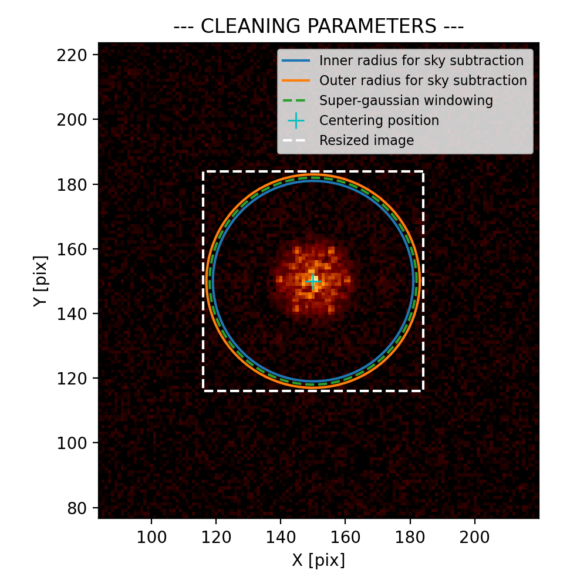
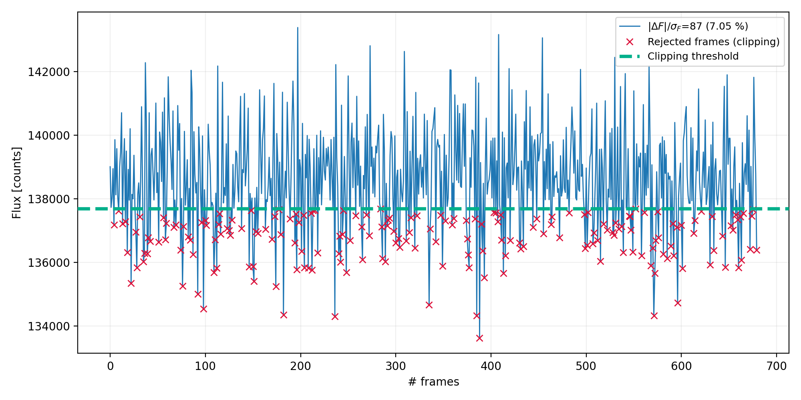
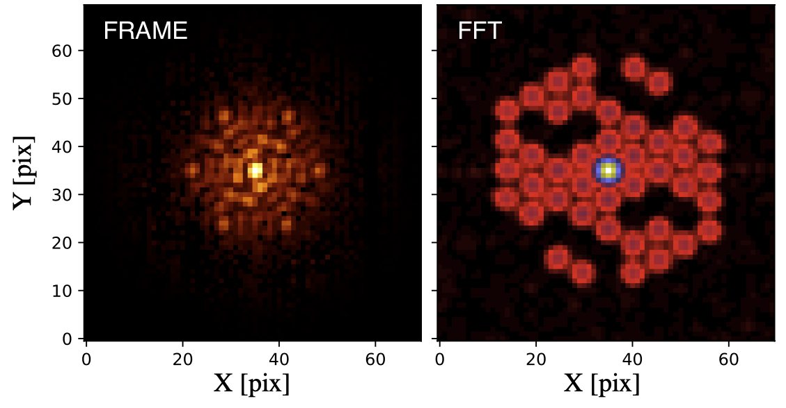
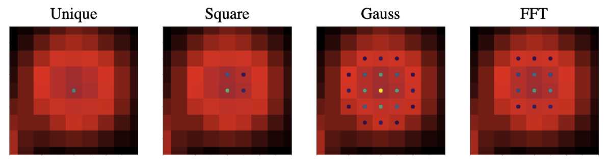
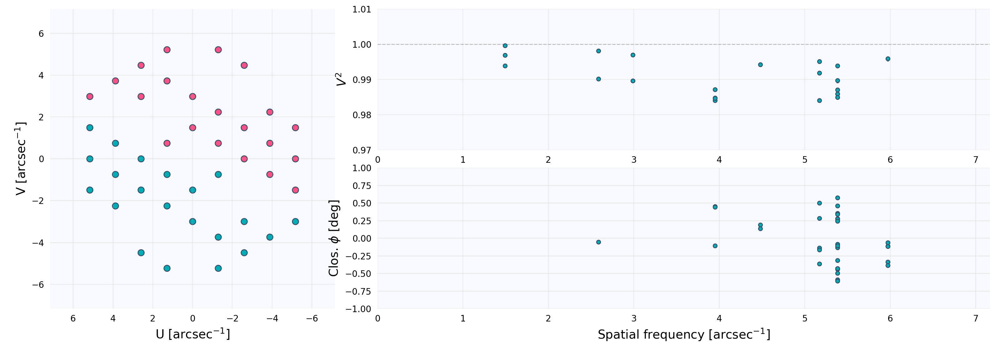

# Tutorials

In this tutorial, we will go through different features of AMICAL. You
can find a detailed description of the principal functions and associated
parameters in their docstrings (easily accessible with good editors, e.g.:
vscode).

- [Step 1: clean and select data](#step-1-clean-and-select-data)
- [Step 2: extract observables](#step-2-extract-observables)
- [Step 3: calibrate V2 & CP](#step-3-calibrate-v2--cp)
- [Step 4: analyse the OIFITS file with
  virgil](#step-4-analyse-the-oifits-file-with-virgil)

In the following, we'll assume you imported the library as:

```python
import amical
```

### Step 1: clean and select data

The major part of data coming from general pipelines (applying dark, flat,
distorsion, etc.) are not enought compliant with the Fourier extracting method
developed within AMICAL.

The first step of running AMICAL consists in cleaning the data in different ways:

- Remove residual sky background (`sky=True`, `r1`, `dr`)
- Crop and center the image (`isz`, `f_kernel=3`),
- Apply windowing (`apod`, `window`),
- Apply bad pixels correction (`bad_map=None`, `add_bad=[]`,
  `remove_bad=False`).

We use a 2d gaussian interpolation to replace the bad pixels (same as
[here](https://docs.astropy.org/en/stable/convolution/)). The keyword argument `bad_map` is
a 2D array (same shape as the data) filled with 0 and 1 where 1 stands for a bad
pixel (hot, cosmic, etc.). Instrument pipelines generally come with bad pixels
map generator, but you can add an unlimited number of bad pixels as the input
list `add_bad` (e.g.: \[[24, 08], [31, 41]])).

```python
nrm_file = "my_nrm_data.fits"

clean_param = {
    "isz": 69,  # final cropped image size [pix]
    "r1": 31,  # Inner radius to compute sky [pix]
    "dr": 2,  # Outer radius (r2 = r1 + dr)
    "apod": True,  # If True, apply windowing
    "window": 32,  # FWHM of the super-gaussian (for windowing)
}

# Firsly, check if the input parameters are valid
amical.show_clean_params(nrm_file, **clean_param)
```

<p align="center">

</p>

***FIG. 1** - Example of appropriate set of parameters to clean NIRISS data.*

If the cleaning parameters seem well located (cyan cross on the centre, sky
radius outside the fringes pattern, etc.), we can apply the cleaning step to the
data.

```python
cube_cleaned = amical.select_clean_data(
    nrm_file, **clean_param, clip=True, clip_fact=0.5
)
```

During the cleaning step, you can decide to apply a lucky imaging selection
(`clip=True`) to accumulate only the best frames in the cube (based on the
integrated fluxes compared to the median: threshold = median(fluxes) -
`clip_fact` * std(fluxes)).

<p align="center">

</p>

***FIG. 2** - Example of integrated flux measurement along the cube (# frames).
The rejected frames are labelled by the red cross. The threshold is represented
with the green dashed line.*

### Step 2: extract observables

The second step is the core of AMICAL: we use the Fourier sampling approach to
extract the interferometric observables (visibilities and closure phases).

The whole challenge when playing with the NRM data is to find the correct
position of each baseline in the Fourier transform. To do so, we implemented 4
different sampling methods (`peakmethod` = ('unique', 'square', 'gauss', 'fft'))
to exploit information spread beyond just the _u_, _v_ positions (see
our SPIE 2020 [reference
paper](https://ui.adsabs.harvard.edu/abs/2020SPIE11446E..11S/abstract) for more
details).

<p align="center">

</p>

***FIG. 3** - Example of NIRISS data. **Left:** Image plane representing the fringe
pattern. **Right:** Fourier transform (Fourier plane).*
<p align="center">

</p>

***FIG. 4** - Zoom on one Fourier peak (called splodge) showing the different sampling methods.*

Based on NIRISS and SPHERE dataset analysis, we recommend using the `'fft'`
method (but feel free to test the other methods for your specific case!). The
expected baseline locations on the detector are computed using the mask
coordinates, the wavelength and the pixel size. In some cases, the mask is not
perfectly aligned with the detector and so requires to be rotated
(`theta_detector = 0`) or centrally scaled (`scaling_uv = 1`).

With AMICAL, the mask coordinates, the wavelengths, the pixel size and the
target name are normally read from the fits file header.
In case where headers are not compliant, you will need to provide the following keyword arguments: `filtname`, `instrum` and `targetname`.

```python
params_ami = {
    "peakmethod": "fft",
    "maskname": "g7",  # 7 holes mask of NIRISS
}

bs = amical.extract_bs(cube_cleaned, file_t, **params_ami)
```

> Note: Other parameters in `amical.extract_bs()` are rarely modified but you
> can check the docstrings for details
> ([bispect.py](amical/mf_pipeline/bispect.py)).

The object `bs` stores the raw observables (`bs.vis2`, `bs.e_vis2`, `bs.cp`,
`bs.e_cp`), the u-v coordinates and wavelength (`bs.u`, `bs.v`, `bs.wl`), the
baseline lengths (`bs.bl`, `bs.bl_cp`), information relative to the used mask
(`bs.mask`), the computed matrices and statistic (`bs.matrix`) and the important
information (`bs.infos`). The `mask`, `infos` and `matrix` attributes also hold various data.

```python
print(bs.keys(), bs.mask.keys())
```

### Step 3: calibrate V2 & CP

Closure phases and square visibilities suffer from systematic terms, caused by
the wavefront fluctuations (temporal, polychromatic sources, non-zero size mask,
etc.). To calibrate aperture masking data, these quantities are measured on one or several identified unresolved (or known size) calibration stars. In practice, we subtract the
calibrator signal from the raw closure phases and normalize the target
visibilities by the calibrator’s visibilities.

```python
# bs_t and bs_c are the results from amical.extract_bs() on the target and
# calibrator respectively.
cal = amical.calibrate(bs_t, bs_c)
```

If several calibrators are available, the calibration factors are computed using
a weighted average to account for variations between sources. In this case,
`bs_c` will be a list of results from `amical.extract_bs()`. The extra errors
induced are then quadratically added to the calibrated uncertainties.

During the calibration procedure, a second data selection can be performed to
reject bad calibrator-source pairs using a sigma-clipping approach (`clip=True`,
using a threshold value in sigma `sig_thres=2`).

```python             }
cal = amical.calibrate(bs_t, [bs_c1, bs_c2, bs_c3], clip=True, sig_thres=2)
```

> Note: For ground based facilities, two additional corrections can be applied
> on V2 to deal with potential piston between holes (`apply_phscorr=True`) or
> seeing/wind shacking variations (`apply_atmcorr=True`). This functionnality
> was only tested on old dataset from the previous IDL pipeline, and so needs to
> be cautiously used (seem to not working on SPHERE data).

> Note: You can decide to normalize the CP uncertaintities by sqrt(n_holes/3)
> take into account the dependant vs. independant closure phases
> (`normalize_err_indep=True`).

Once again, `cal` is an object containing the calibrated observables
(`cal.vis2`, `cal.e_vis2`, etc.), u-v coordinates (`cal.u`, `cal.v`, `cal.u1`,
`cal.v2`, etc.), wavelength (`cal.wl`) and the output objects from step 2
(`cal.raw_t`, `cal.raw_c`).

You can now visualize the calibrated observables with `amical.show()` and save
them as the standard oifits file with amical.save().

```python
amical.show(cal, cmax=1, vmin=0.97, vmax=1.01)
```

<p align="center">

</p>
<p align="center">

***FIG. 5** - Example of calibrated observables obtained with NIRISS. **Left:** u-v
plan, **Top-right:** squared visibilities, **Lower-right:** Closure phases.*

By default, we assume that the u-v plan is oriented on the detector
(north-up, east-left) with `pa=0` in degrees. The true position angle is
normally computed during the step 2 (not yet available for all instruments) and
so need to be given as input with `pa=bs.infos.pa`.

Few other parameters are available to set the axe limites (`vmax`, `vmin`,
`cmax`), set units (`unit`, `unit_cp`), log scale (`setlog`), flags
(`true_flag_v2`, `true_flag_cp`), etc.

```python
oifits_file = "my_oifits_results.oifits"

amical.save(cal, oifits_file, pa=bs_t.infos.pa)
```

If you want to save the independent CP only, you can add `ind_hole=0`
(0..n_holes-1) to select only the CP with the given aperture index. The others
parameters can be check in the docstrings.

The OIFITS file records the observation date (`MJD`) and integration time
from the original header (`MJD-OBS` or `DATE-OBS`, and `EXPTIME` or ESO
`DIT`×`NDIT`), so files from several epochs can be fitted together.

> Note: `save()` looks up the target in SIMBAD to fill the `OI_TARGET` table
> (coordinates, proper motion, parallax, spectral type). If the query fails,
> it warns and falls back to the `RA`/`DEC` keywords of the original header.
> On machines without internet access (e.g. HPC compute nodes), switch the
> query off with `query_simbad=False`, or for a whole batch job by setting the
> environment variable `AMICAL_NO_SIMBAD=1` (this also applies to the
> `amical calibrate` command line). For simulated data, use `fake_obj=True`:
> SIMBAD is not contacted and the coordinates are set to zero.

### Step 4: analyse the OIFITS file with virgil

AMICAL's job ends at the calibrated OIFITS file. To fit models to it, we
recommend [virgil](https://benjaminpope.github.io/virgil/), an
interferometry fitting package built on JAX that reads AMICAL's OIFITS files
directly. It does fast likelihood grids for binary searches, contrast limits
(Absil et al. 2011; Ruffio et al. 2018), least-squares fits and HMC
posteriors, for point sources and for resolved and extended models.

```shell
$ python -m pip install amical[virgil]  # or: python -m pip install virgil-astro
```

virgil needs Python ≥ 3.11 and JAX; it can live in its own environment, as the
two packages only share the OIFITS files. (The distribution is `virgil-astro`;
`pip install virgil` installs an unrelated package.)

```python
import jax.numpy as jnp
from virgil.grid_fit import best_grid_point, likelihood_grid
from virgil.models import BinaryModelCartesian
from virgil.oidata import OIData

data = OIData("Saveoifits/my_oifits_results.oifits")  # or a list of files

samples = {
    "dra": jnp.linspace(-250.0, 250.0, 101),  # mas
    "ddec": jnp.linspace(-250.0, 250.0, 101),  # mas
    "flux": 10 ** jnp.linspace(-4.0, -1.0, 31),  # companion/primary flux ratio
}
loglike = likelihood_grid(data, BinaryModelCartesian, samples)
print(best_grid_point(loglike, samples))
```

[example_analysis.py](example_analysis.py) continues with a least-squares
refinement of the best grid point and Ruffio contrast limits. On the simulated
NIRISS binary in `tests/data/test.oifits` it finds a separation of 147.1 mas,
a position angle of 46.9° and a contrast of 5.97 mag, in agreement with the
CANDID result previously shown here (147.7 mas, 46.6°, 6.0 mag). The
[virgil documentation](https://benjaminpope.github.io/virgil/) covers
posterior sampling, error inflation and extended-source models.

> Note: AMICAL saves all N(N-1)(N-2)/6 closure phases, of which only
> (N-1)(N-2)/2 are independent. virgil whitens them together, so save them all
> and do not also apply `normalize_err_indep=True`, which would count the
> redundancy twice.

#### Legacy CANDID and Pymask functions

AMICAL no longer bundles CANDID and Pymask. Their AMICAL functions still
exist, with the same arguments and return values, but are now computed with
virgil (install it with `pip install amical[virgil]`):

| function | what virgil computes |
|---|---|
| `amical.candid_grid` | likelihood grid of a companion around a uniform-disk primary, refined by least squares; uncertainties from the Fisher matrix |
| `amical.candid_cr_limit` | 3σ detection limits (Absil et al. 2011), after removing `fitComp` if given |
| `amical.pymask_grid` | χ² grid in separation, position angle and contrast ratio, closure phases only |
| `amical.pymask_mcmc` | posterior of the same binary, sampled with NUTS (HMC) instead of emcee |
| `amical.pymask_cr_limit` | 3σ contrast limits versus separation (Absil), closure phases only |

```python
fit = amical.candid_grid(inputdata, rmin=20, rmax=250, step=50, diam=0)
cr = amical.candid_cr_limit(inputdata, rmin=20, rmax=250, step=50, fitComp=fit["comp"])
```

The results are close to, but not identical with, those of the original
packages. CANDID's "injection" limits and Pymask's Monte Carlo limits are
replaced by the Absil limits. virgil also accounts for the correlations
between the N(N-1)(N-2)/6 closure phases, so its uncertainties are larger than
Pymask's were (by about √(35/15) ≈ 1.5 for a 7-hole mask) and no `err_scale`
correction for redundancy is needed. On the simulated binary,
`candid_grid` gives 147.1 ± 0.8 mas, 46.9 ± 0.3° and 5.98 ± 0.01 mag, and
`pymask_mcmc` 147.1 ± 1.3 mas, 46.8 ± 0.5° and 5.98 ± 0.02 mag. For new
analyses, use virgil directly as above. `amical.smartfit` is deprecated.
